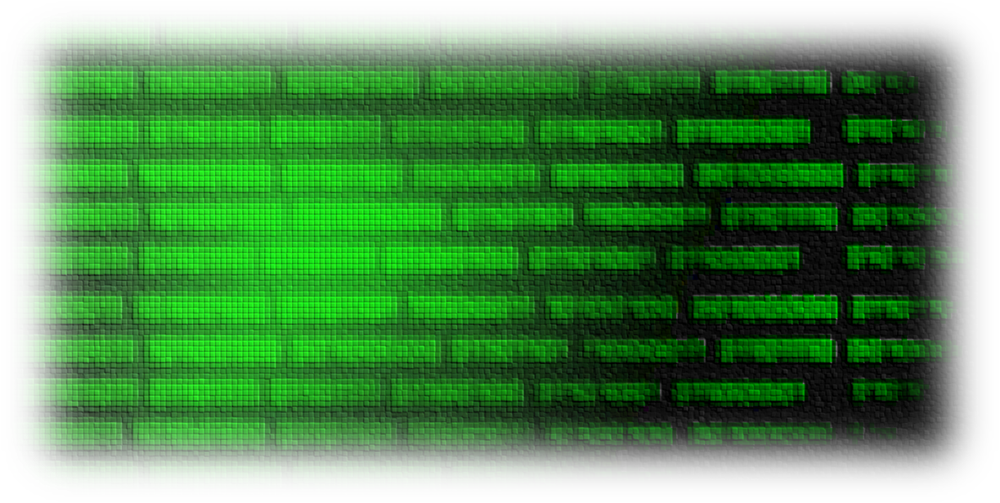

# Esitys

- [Projekti](#projekti)
  - [Kuvaus](#kuvaus)
  - [käytetty](#mitä-ollaan-käytetty)
  - [Tekijät](#tekijät)

## Projekti

404 IQ Not Found

### Kuvaus

404 IQ Not Found on yksinkertainen tietovisa, missä luetaan koodia kuvasta, jonka jälkeen vastataan monivalintakysymykseen. Pelin tarkoitus on opetella koodin lukemista.
Tietovisa on tarkoitettu koodaajille ja koodauksen opettelijoille.

## Mitä ollaan käytetty

Pelin tekemiseen on käytetty:

- Svelte
- JavaScript
- TypeScript
- CSS
- HTML

## Tekijät

- Minttu Räisänen
- Joona Järvi
- Netta Tavi
- Annika Järvinen
